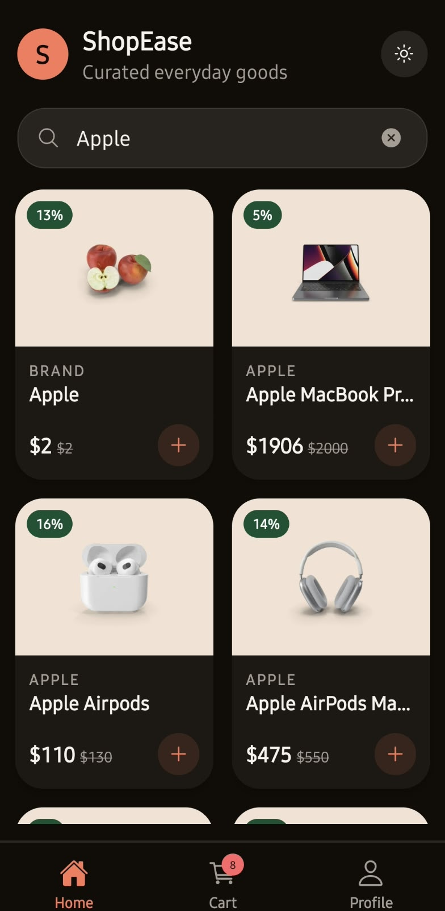
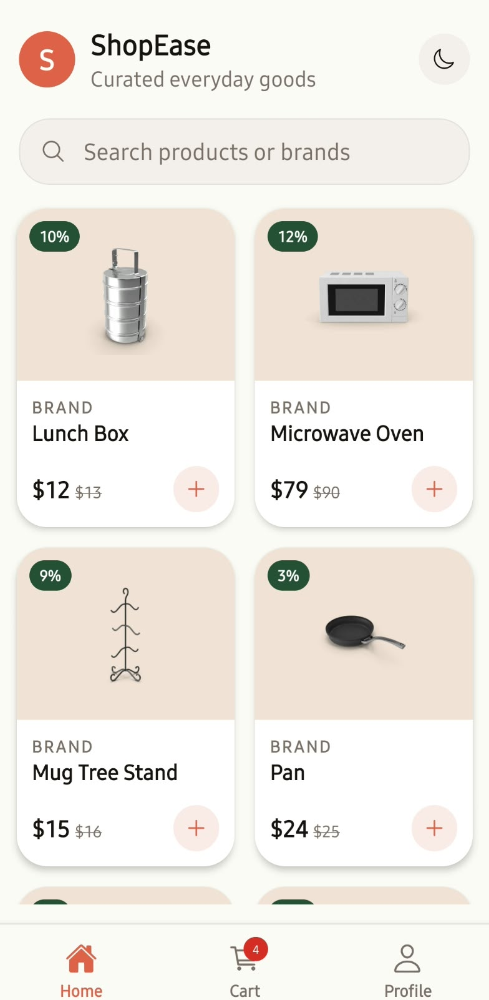
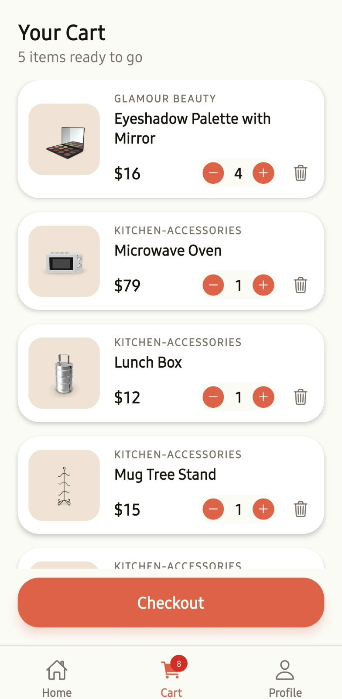
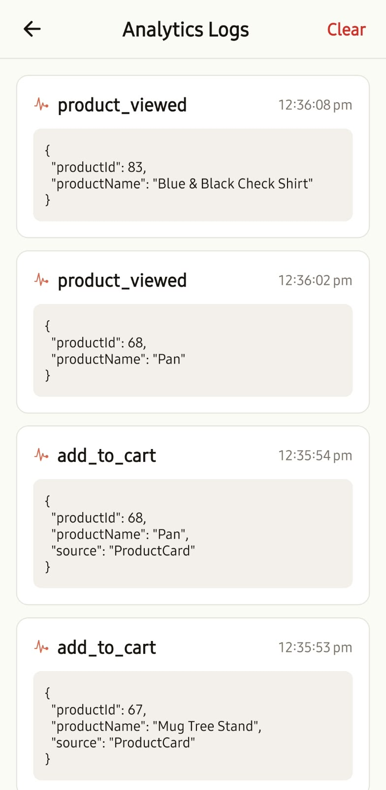
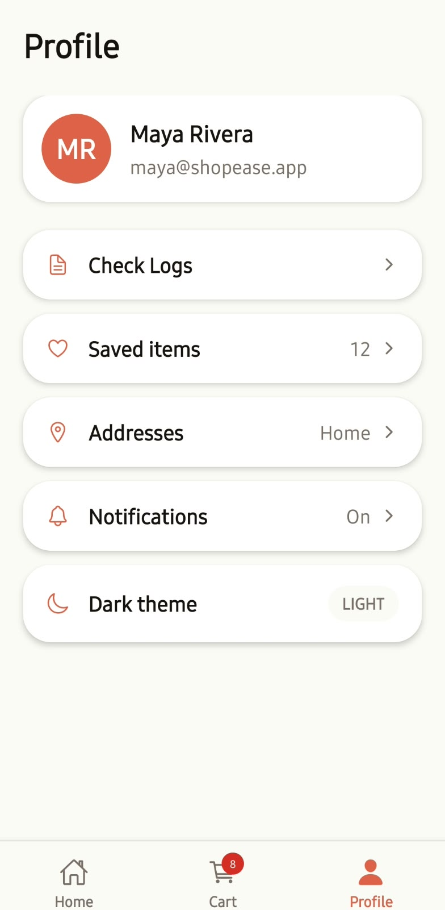
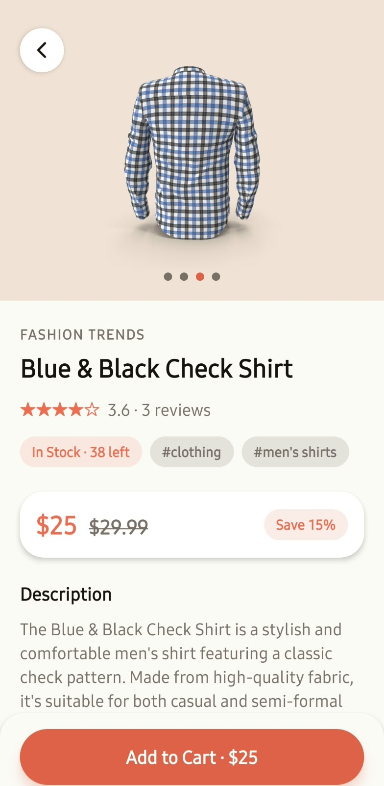

# Nua E-Commerce App

Welcome to the Nua E-Commerce application! This is a modern, fully-featured React Native application built to demonstrate infinite scrolling, robust state management, and seamless offline persistence.

## Screenshots

Here is a quick look at the application in action:

<div style="display: flex; flex-direction: row; overflow-x: auto; white-space: nowrap; gap: 10px; padding-bottom: 10px;">
  
  
  
  
  
  
</div>

## Try it out!

You don't need to build the project from scratch to test it! Anybody can download the app for testing. There is a compiled **APK** available in `src/assets/` that you can install directly on your Android device to experience the app immediately.

---

## Video Walkthrough

You can watch a full walkthrough of the application's features and UI flow here:
[**Watch the Application Walkthrough Video**](https://drive.google.com/file/d/1Odsa7BaRenmLVx49r5OD7hvgaqSeVE4u/view?usp=drivesdk)

---

## Setup & Run Instructions

If you'd like to run the project locally on your machine, follow these steps:

### Prerequisites

Make sure you have completed the [React Native Environment Setup](https://reactnative.dev/docs/set-up-your-environment) guide before proceeding.

### 1. Install Dependencies

```bash
# Install npm packages
npm install

# For iOS, install pods
cd ios && pod install && cd ..
```

### 2. Start the Metro Server

```bash
npm start
```

### 3. Run the Application

Open a new terminal window and run:

```bash
# For Android
npm run android

# For iOS
npm run ios
```

---

## Assumptions & Trade-offs

During the development of this application, several architectural decisions were made:

1. **State Management (Redux Toolkit vs Context API vs Zustand):**
   - _Decision:_ Chose Redux Toolkit.
   - _Trade-off:_ While Context API has less boilerplate and Zustand offers a simpler, lighter alternative, Redux Toolkit was chosen because it provides a highly scalable architecture for cart management and integrates perfectly with `redux-persist`. This allowed for seamless persistence of the user's cart to `AsyncStorage` with minimal friction.
2. **Data Fetching (React Query):**
   - _Decision:_ Used TanStack React Query instead of raw `axios` calls within `useEffect`.
   - _Trade-off:_ Adds an extra dependency, but it completely abstracts away the complexity of infinite scroll pagination, data caching, and implementing **exponential backoff retries** when the DummyJSON API is temporarily down.
3. **UI Library:**
   - _Decision:_ Built custom UI components (Cards, Carousels) instead of using a heavy UI library like NativeBase or UI Kitten.
   - _Trade-off:_ Requires more CSS/styling work upfront, but results in a much leaner, faster app with a highly customized and premium aesthetic.

---

## Future Improvements

With more time, here are the key areas I would improve and expand upon:

1. **Landscape Mode Support:**
   - Currently, the app is optimized for portrait viewing. I would implement dynamic layout recalculations to fully support landscape orientation, especially for the product grid and image carousel.
2. **Rich Animations:**
   - Introduce shared-element transitions when navigating from the Home screen's product card to the Product Detail screen to make the user experience feel incredibly fluid and premium.
3. **Enhanced Offline Capabilities:**
   - While the cart and dark mode preferences are persisted and product data caching is currently working for 24 hours, I would extend offline support to allow users to browse the catalog perfectly even without an active internet connection.
4. **Enhanced Testing:**
   - I have not implemented any testing here yet. With more time, I would introduce test coverage across components and integrate E2E testing tools like Detox to ensure critical user flows (like adding to cart) never break.
